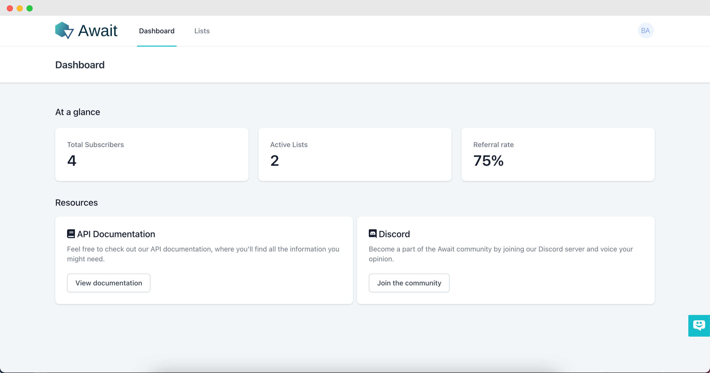
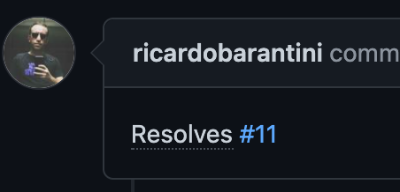

# Await

[](https://github.com/getawait/await/actions?query=workflow%3ALaravel)
[](https://github.styleci.io/repos/290447940?branch=master)  
Working on a startup? A new product launch? Create your own viral waiting list, with a built-in referral system, and gamify the process of building audiences.

Disclaimer: The project is still actively in development, and may be rough around the edges.


*The dashboard*

## Prerequisites
- PHP 7.4
- MySQL Server (Preferred) / SQLite
- Composer
- Node.js/NPM

## Installation
```shell script
composer install
php artisan await:install
npm install
npm run prod
```

## Looking to contribute?
The project is using Laravel, Vue & Tailwind. Don't worry if you've got no experience with these, they're super easy to pick up ☺️.

### New feature
There's a semi-useful kanban board of the things I'd love to see in Await. If what you're looking to build is not there, it may be worth using our "discussions" feature, or even better, hop on Discord and let's chat!

**Board**: https://github.com/getawait/await/projects  
**Discussions**: https://github.com/getawait/await/discussions  
**Discord**: https://discord.gg/PhtUHnx9nk

### Bugfix
Before starting work any piece of bug, be sure to see if there's already an issue open for it. If there isn't, open one, then open your pull request referencing the issue ID.

**Example**: https://github.com/getawait/await/pull/14

